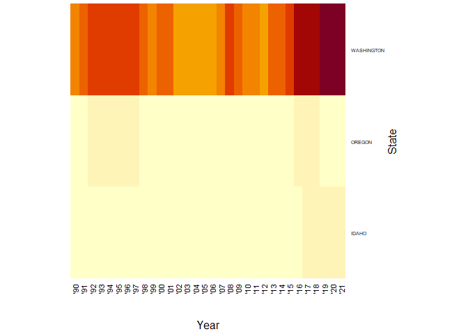
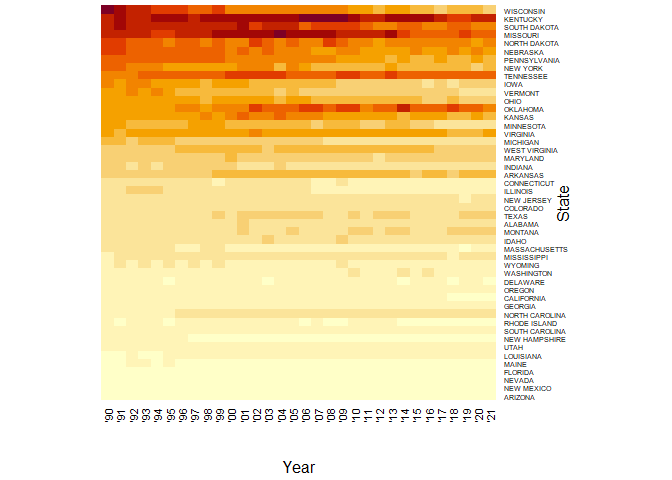
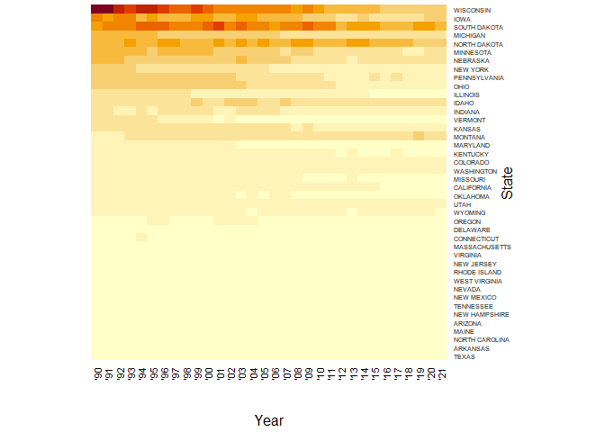
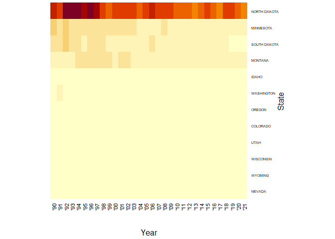
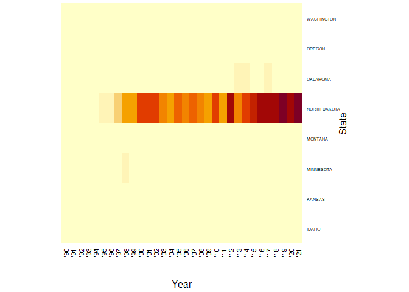
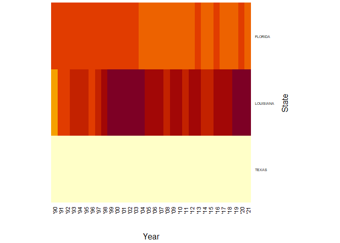
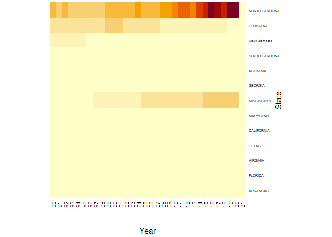
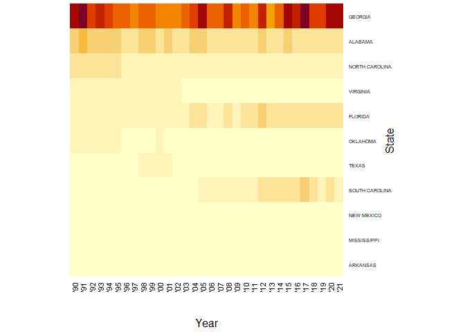
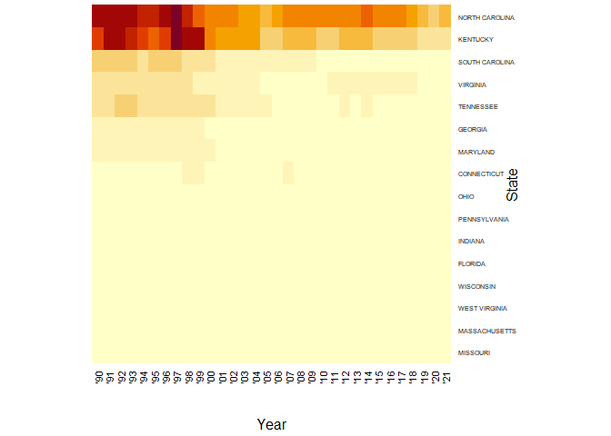

State Crops
================
Mandy Liesch
10/23/2021

-   [USDA NASS Data](#usda-nass-data)
-   [Major Cash Crops](#major-cash-crops)
    -   [Corn](#corn)
    -   [Soybean](#soybean)
    -   [Cotton](#cotton)
    -   [Rice](#rice)
-   [Wheat](#wheat)
    -   [Winter Wheat](#winter-wheat)
    -   [Spring Wheat](#spring-wheat)
    -   [Durum Wheat](#durum-wheat)
-   [Other Grains](#other-grains)
    -   [Oats](#oats)
    -   [Barley](#barley)
    -   [Flaxseed](#flaxseed)
    -   [Sorghum](#sorghum)
-   [Oil Crops](#oil-crops)
    -   [All Sunflower](#all-sunflower)
    -   [Canola](#canola)
-   [Sugar Crops](#sugar-crops)
    -   [Sugar Beets](#sugar-beets)
    -   [Sugarcane (Harvested Sugar and
        Seed)](#sugarcane-harvested-sugar-and-seed)
-   [Potatoes](#potatoes)
    -   [Potatoes](#potatoes-1)
    -   [Sweet Potatoes (No 2021 Data)](#sweet-potatoes-no-2021-data)
-   [Pulses and Beans](#pulses-and-beans)
    -   [Dry Beans](#dry-beans)
    -   [Dry Peas (And Austrian Peas)](#dry-peas-and-austrian-peas)
    -   [Peanuts](#peanuts)
-   [Tobacco (Harvested Acres ONLY)](#tobacco-harvested-acres-only)

## USDA NASS Data

State Crop Production Data from 1990-2021 in acres. The NASS data for
each crop was downloaded by state, and trimmed into three columns in
Microsoft Excel: Year, State, and Acres. The total land area of each
state is noted in the GIS shapefiles. The square meter values were
turned to acreages using the calculate function in an attribute table,
and then the attribute table was exported to a .csv file for use in
calculating the total crop area

Once the file is read in and transformed, with new percentages
calculated, the data is linked to a second function that transforms the
data into a matrix format for use in the creation of heatmaps and plots.

And this function uses the data matrix from the above functions, and
transfers the matrix dataframe to a graphical heat map based on the crop
selected.

## Major Cash Crops

### Corn

### Soybean

### Cotton

### Rice

## Wheat

### Winter Wheat

### Spring Wheat

### Durum Wheat

## Other Grains

### Oats

### Barley

### Flaxseed

### Sorghum

## Oil Crops

### All Sunflower

### Canola

## Sugar Crops

### Sugar Beets

### Sugarcane (Harvested Sugar and Seed)

## Potatoes

### Potatoes

### Sweet Potatoes (No 2021 Data)

## Pulses and Beans

### Dry Beans

### Dry Peas (And Austrian Peas)

### Peanuts

## Tobacco (Harvested Acres ONLY)

