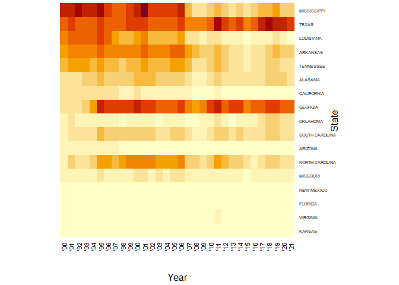
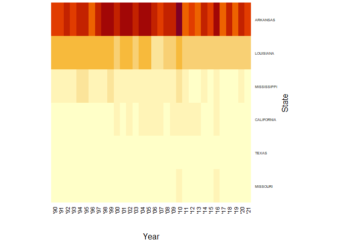
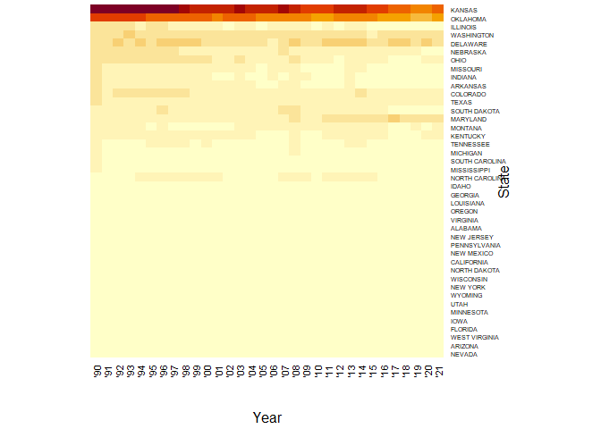
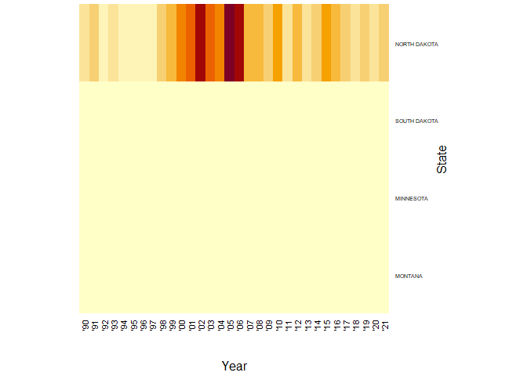
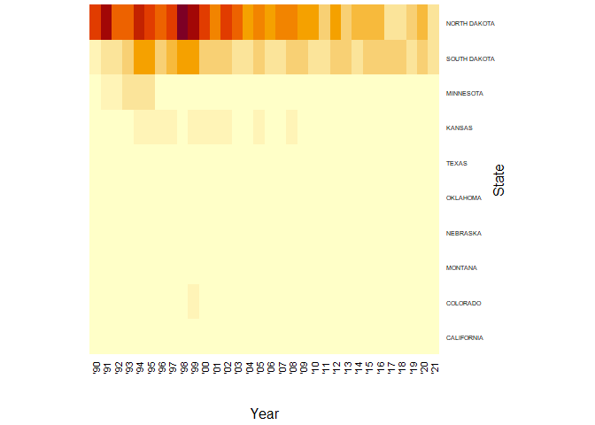

State Crops
================
Mandy Liesch
10/23/2021

-   [USDA NASS Data](#usda-nass-data)
-   [Major Cash Crops](#major-cash-crops)
    -   [Corn](#corn)
    -   [Soybean](#soybean)
    -   [Cotton](#cotton)
    -   [Rice](#rice)
-   [Wheat](#wheat)
    -   [Winter Wheat](#winter-wheat)
    -   [Spring Wheat](#spring-wheat)
    -   [Durum Wheat](#durum-wheat)
-   [Other Grains](#other-grains)
    -   [Oats](#oats)
    -   [Barley](#barley)
    -   [Flaxseed](#flaxseed)
    -   [Sorghum](#sorghum)
-   [Oil Crops](#oil-crops)
    -   [All Sunflower](#all-sunflower)
    -   [Canola](#canola)
-   [Sugar Crops](#sugar-crops)
    -   [Sugar Beets](#sugar-beets)
-   [Potatoes](#potatoes)
    -   [Potatoes](#potatoes-1)
    -   [Sweet Potatoes](#sweet-potatoes)
-   [Pulses and Beans](#pulses-and-beans)
    -   [Dry Beans](#dry-beans)

## USDA NASS Data

``` r
prePro<-function(crop){
  cropFile<-paste(crop,".csv", sep = "")
  return(cropFile)
}
```

State Crop Production Data from 1990-2021 in acres. The NASS data for
each crop was downloaded by state, and trimmed into three columns in
Microsoft Excel: Year, State, and Acres. The total land area of each
state is noted in the GIS shapefiles. The square meter values were
turned to acreages using the calculate function in an attribute table,
and then the attribute table was exported to a .csv file for use in
calculating the total crop area

``` r
# Develop a function to read in cropping history from 
# 1990-2021 (or whatever year is latest)
cropRead<-function(crop){
  #####
  ## This function is designed to take the long form ###  
  ## using year and state, and compresses it to the  ###  
  ## wide form, with a state having an individual    ###  
  ## line, then it calculates the TOTAL percentage   ###    
  ## land area of each crop and returns a data frame ###
  ##### 
  cropFile<-prePro(crop)
  #read in the input CSV file.
  cropLong<-read.csv(cropFile)
  #create an acre output column.
  cropLong$acres<-cropLong[,3]
  #Default values tend to be characters with commas. This  
  # line ensures that the data is transformed to numeric.
  cropLong$acres<-as.numeric(gsub(",", "", cropLong$acres))
  #Remove the initial character column
  cropLong[,3]<-NULL
  #Transfer the crop acreage from long format to wide
  cropWide<-spread(cropLong, key = Year, value = c(3))
  # The state Acres file was derived from GIS polygons  
  # from the Census Bureau. Square meters of land area  
  # was converted into acres in ArcMap 10.4.1
  stateAcres<-read.csv("STATEAcres.csv")
  # Make sure the state name is changed to uppercase
  stateAcres$NAME<-toupper(stateAcres$NAME)
  # Merge the state acres data with the crop wide data  
  # by state name, only keeping those that appear in the  
  # cropping wide matrix. 
  cropMerge<-merge(stateAcres, cropWide, by.x = 'NAME', by.y = 'State', all.y=TRUE)
  # Calculate the percentage of the total crop area  
  # produced per year divided by the acreage.
  percentages<-  cropMerge %>%
   mutate_at(vars(4:35) , funs(P =./cropMerge$AcreArea * 100))
  # Use the states as row names
  row.names(percentages) <- percentages$NAME
  # Remove the raw acreage values and leave only the
  # percentages
  cropNew <- percentages[, 36:67]
  return(cropNew)
}
```

Once the file is read in and transformed, with new percentages
calculated, the data is linked to a second function that transforms the
data into a matrix format for use in the creation of heatmaps and plots.

``` r
heatProcess<-function(cropFile){
  cropNew<-cropRead(cropFile)
  row.names.remove<-c("OTHER STATES")
  cropNew<-cropNew[!(row.names(cropNew) %in% row.names.remove), ]
  cropNew[is.na(cropNew)]<-0
  cropNew<- cropNew[order(cropNew$`1990_P`),]
  crop_matrix <- data.matrix(cropNew)
  crop_heatmap <- heatmap(crop_matrix, Rowv=NA, Colv=NA, scale="none", cexRow=0.5)
  return(crop_heatmap)
}
```

And this function uses the data matrix from the above functions, and
transfers the matrix dataframe to a graphical heat map based on the crop
selected.

## Major Cash Crops

### Corn

``` r
corn<-heatProcess('corn')
```

    ## Warning: `funs()` was deprecated in dplyr 0.8.0.
    ## Please use a list of either functions or lambdas: 
    ## 
    ##   # Simple named list: 
    ##   list(mean = mean, median = median)
    ## 
    ##   # Auto named with `tibble::lst()`: 
    ##   tibble::lst(mean, median)
    ## 
    ##   # Using lambdas
    ##   list(~ mean(., trim = .2), ~ median(., na.rm = TRUE))
    ## This warning is displayed once every 8 hours.
    ## Call `lifecycle::last_lifecycle_warnings()` to see where this warning was generated.

<!-- -->

### Soybean

``` r
soybean<-heatProcess('soybean')
```

<!-- -->

### Cotton

``` r
cotton<-heatProcess('cotton')
```

<!-- -->

### Rice

``` r
rice<-heatProcess('rice')
```

<!-- -->

## Wheat

### Winter Wheat

``` r
wintWheat<-heatProcess('winterwheat')
```

<!-- -->

### Spring Wheat

``` r
sprWheat<-heatProcess('springwheat')
```

<!-- -->

### Durum Wheat

``` r
durwheat<-heatProcess('durumwheat')
```

<!-- -->

## Other Grains

### Oats

``` r
oats<-heatProcess('oats')
```

<!-- -->

### Barley

``` r
barley<-heatProcess('barley')
```

<!-- -->

### Flaxseed

``` r
flaxseed<-heatProcess('flaxseeds')
```

<!-- -->

### Sorghum

``` r
sorghum<-heatProcess('sorghum')
```

<!-- -->

## Oil Crops

### All Sunflower

``` r
sunflower<-heatProcess('sunflower')
```

<!-- -->

### Canola

``` r
canola<-heatProcess('canola')
```

<!-- -->

## Sugar Crops

### Sugar Beets

``` r
sugarbeets<-heatProcess('sugarbeets')
```

    ## Warning in cropRead(cropFile): NAs introduced by coercion

<!-- -->

## Potatoes

### Potatoes

``` r
potato<-heatProcess('potatos')
```

    ## Warning in cropRead(cropFile): NAs introduced by coercion

<!-- -->

### Sweet Potatoes

``` r
#sweetPotato<-heatProcess('sweetpotato')
```

## Pulses and Beans

### Dry Beans

``` r
drybeans<-heatProcess('drybeans')
```

    ## Warning in cropRead(cropFile): NAs introduced by coercion

<!-- -->

\`\`\`
